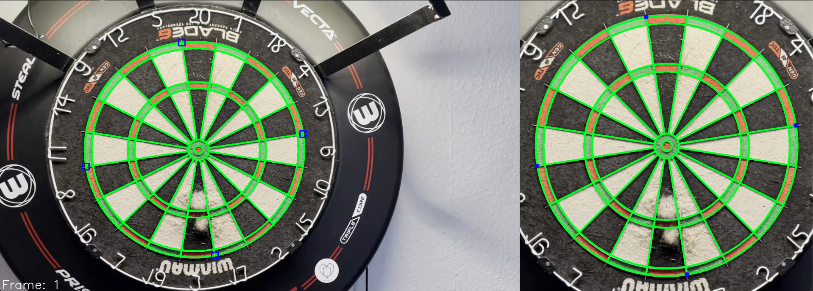
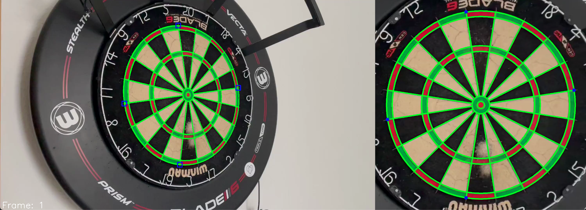
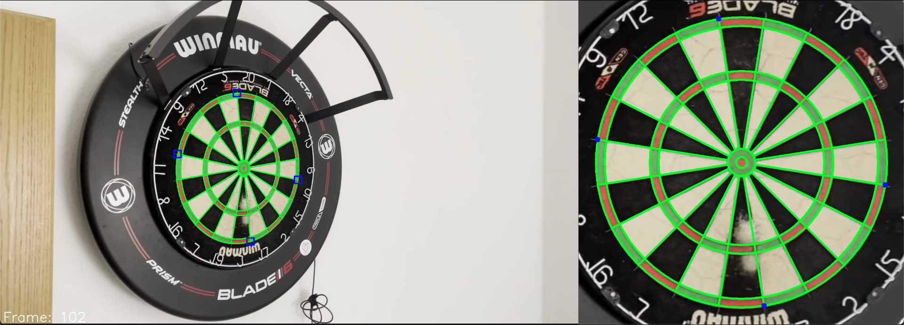
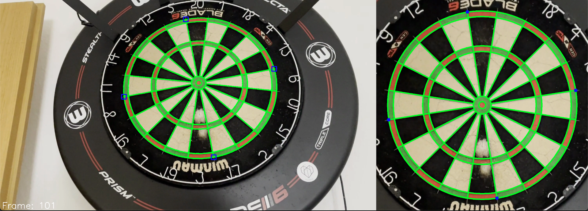

# Dartboard Detection 🎯

## Overview
This project aims to **detect a dartboard using YOLO** and generate an automated counter for playing darts. The system identifies key dartboard regions, corrects perspective distortion, and enables real-time tracking.

## Challenges
- **Perspective Correction:** Unwarping the camera’s perspective to align the dartboard correctly.
- **Field Detection:** Identifying single dartboard fields with high accuracy.
- **Real-Time Processing:** Ensuring the system runs efficiently for live gameplay.

## Methodology
1. **Labeling:**
    - Developed a semi-automated Python pipeline for efficient annotation ([here](https://github.com/JBrakel/createDatasets.git)).
2. **Dataset:**
    - 8 classes representing the **outer points of the double fields** for numbers **20, 6, 3, and 11**.
3. **Training YOLOv8:**
    - Recorded real dartboard footage and trained a **YOLOv8 model** on the labeled data.
4. **Homography & Unwarping:**
    - Using **four detected points**, the system applies a **homography transformation** to generate an unwarped view of the dartboard.
5. **Visualization:**
    - Draws the dartboard (green lines) on the unwarped image and maps it back to the original perspective.

## Next Steps 🚀
- **Dart Detection:** Identify darts and their impact points.
- **Game Logic Implementation:** Track scores and automate game rules.
- **GUI Development:** Create an interactive interface for players.

## Usage
1. **Setup Configuration:** Modify `config.json` to set dataset paths, model files, and parameters.
2. **Run Detection:** Execute the main script to start detection and visualization.
3. **Calibrate Camera:** Ensure proper dartboard alignment for better accuracy.

## Results

